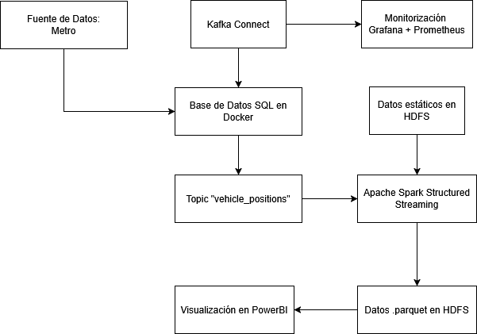
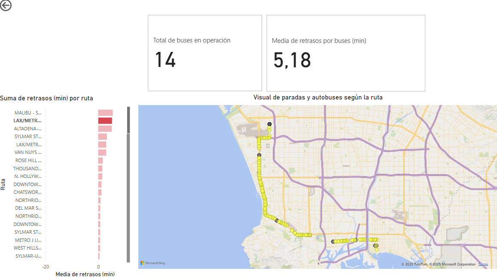
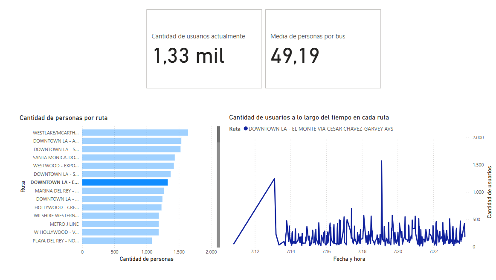

# Proyecto Big Data: Análisis de Transporte Público con GTFS
## Descripción General

El objetivo de este proyecto es construir un sistema completo de análisis de datos en tiempo real sobre el transporte público de la ciudad de Los Ángeles, utilizando tecnologías propias del ecosistema Big Data.

La fuente principal de datos es la API de GTFS en tiempo real proporcionada por LA Metro. A partir de ahí, se desarrolla una arquitectura distribuida para la ingestión, procesamiento, almacenamiento y visualización de datos en tiempo real.

## Arquitectura General

El sistema está compuesto por los siguientes componentes:

- Fuente de Datos: API pública GTFS de LA Metro.
- Ingesta: Python + MySQL + Kafka Connect.
- Procesamiento en Tiempo Real: Apache Spark Structured Streaming.
- Almacenamiento: Apache HDFS (formato Parquet).
- Visualización: Power BI.
- Monitorización: Prometheus + Grafana.

## Flujo de Datos

-  Obtención de Datos: Un script en Python realiza peticiones periódicas a la API GTFS, obteniendo la posición y características de los autobuses en tiempo real.
-  Persistencia Inicial: Los datos se almacenan en una base de datos MySQL para facilitar su lectura por Kafka Connect.
- Kafka Connect: Extrae automáticamente nuevos registros de MySQL y los envía al tópico `vehicle_position` en Apache Kafka.
- Spark Structured Streaming: Un job en Spark lee el tópico `vehicle_position`, transforma los datos y los guarda en HDFS en formato Parquet.
- HDFS: Se persisten los datos Parquet junto a los datos estáticos del estándar GTFS.
- Power BI: Se conecta a los archivos Parquet en HDFS y visualiza la información de manera clara e interactiva.



## Tecnologías Utilizadas
Python -	Extracción de datos desde la API GTFS

MySQL  -	Almacenamiento temporal

Apache Kafka -	Sistema de datos en tiempo real

Kafka Connect - Conector para mover datos desde MySQL a Kafka

Apache Spark - Procesamiento de streaming y escritura en HDFS

HDFS - Sistema de almacenamiento distribuido

Power BI - Visualización de datos

Prometheus + Grafana - Monitorización de recursos y rendimiento del sistema

VirtualBox - Entorno de ejecución del sistema distribuido

## Detalles Técnicos

### Estrategia de Ingesta del Productor Python
Para evitar superar el límite de peticiones establecido por la API GTFS en tiempo real de LA Metro, se ha implementado una estrategia de ingesta por lotes escalonados. El productor en Python realiza una única petición a la API cada 10 segundos. Esta petición obtiene la información completa de todos los vehículos disponibles en ese momento.

En lugar de insertar todos los datos directamente en la base de datos, el script divide la respuesta en 10 minibatches, que son insertados en MySQL de forma progresiva, uno por segundo. De esta manera, se consigue un flujo de datos más constante hacia Kafka Connect y se evita una sobrecarga puntual tanto en MySQL como en el sistema de procesamiento.
### Ajuste de Zona Horaria
Los timestamps proporcionados por la API están en zona horaria UTC. Se ajusta al huso horario de Los Ángeles restando 9 horas:

```
datetime.fromtimestamp(vehicle.timestamp) - timedelta(hours=9)
```

### Cálculo de Datos Sintéticos
Para mejorar la capacidad de realizar Business Inteligence, se ha optado por generar sintéticamente unos datos de cantidad de usuarios por cada autobus:

```
def check_stop_event(bus_id, vehicle_stop):
    if bus_id not in last_stops:
        amount_people = random.randint(0, 70)
        last_stops[bus_id] = (vehicle_stop, amount_people)
        return amount_people
    elif vehicle_stop != last_stops[bus_id][0]:
        new_amount_people = min(70, max(0, last_stops[bus_id][1] + random.randint(-5, 10)))
        last_stops[bus_id] = (vehicle_stop, new_amount_people)
        return new_amount_people
    else:
        return last_stops[bus_id][1]
```

## Esquema de Datos
Los datos iniciales recibidos mediante la API se guardan en el siguiente formato:

- `internal_id`: ID interno para el correcto funcionamiento de Kafka Connect
- `id`: Identificador de autobús
- `trip_route_id`: Identificador de ruta
- `trip_trip_id`: Identificador de viaje
- `position_latitude`: Posición en latitud del vehículo
- `position_longitude`: Posición en longitud del vehículo
- `current_stop_sequence`: Orden de la siguiente parada en la ruta
- `current_status`: Estado del vehículo (parado, en movimiento)
- `amount_people`: Cantidad de personas en el vehículo
- `timestamp`: Momento en el que se envió el dato del vehículo

Por otro lado, los datos transformados, almacenados en HDFS y cargados en PowerBI siguen la siguiente estructura:

- `vehicle_id`: Identificador del autobús
- `route_id`: Identificador de ruta
- `trip_id`: Identificador de viaje
- `location`: Coordenadas GPS
- `current_status`: Estado del vehículo (parado, en movimiento)
- `timestamp`: Fecha y hora ajustada
- `stop_id`: Identificador de la siguiente parada
- `stop_name`: Nombre de la siguiente parada
- `amount_people`: Cantidad de personas en el vehículo
- `time_diff_min`: Retraso actual en minutos

## Requisitos del Sistema

Para el despliegue del sistema se requieren los siguientes recursos y configuraciones:

### Infraestructura
- **Número de máquinas virtuales:** 4
- **Sistema operativo:** Ubuntu (versión recomendada: 20.04 LTS o superior)
- **Asignación de roles:**
  - `master` → `192.168.56.10`
  - `nodo1` → `192.168.56.11`
  - `nodo2` → `192.168.56.12`
  - `nodo3` → `192.168.56.13`

### Red y conectividad
- Todas las máquinas deben estar configuradas dentro de la misma red interna o red en puente, con direcciones IP estáticas como se indica arriba.
- Es imprescindible habilitar la conexión SSH entre todas las máquinas para permitir la gestión remota y la ejecución distribuida de procesos.
### Resolución de nombres en la máquina host

Para facilitar la comunicación hacia los nodos del clúster, se recomienda establecer la resolución de nombres en la máquina host.

Para ello, es necesario editar el archivo `/hosts` en la máquina e incluir las siguientes líneas:

192.168.56.10 master\
192.168.56.11 nodo1\
192.168.56.12 nodo2\
192.168.56.13 nodo3

Esto permite conectarse a los servicios cómo PowerBI y Grafana más fácilmente.
### Componentes y servicios distribuidos
- **HDFS (Hadoop Distributed File System):**
  - Configuración distribuida entre el nodo `master` y los nodos `nodo1`, `nodo2` y `nodo3`.
  - Se requiere sincronización de los servicios `namenode` y `datanode` entre las máquinas.

- **Apache Spark:**
  - Instalación y configuración de Spark en modo clúster, utilizando el nodo `master` como `Spark Master` y los demás nodos (`nodo1`, `nodo2`, `nodo3`) como `Spark Workers`.
  - El sistema debe garantizar la comunicación fluida entre el `Spark Master` y los `Workers`.

- **Base de datos SQL (contenedor Docker):**
  - Se debe desplegar una base de datos MySQL mediante un contenedor Docker, accesible desde las demás máquinas del clúster.
  - Esta base de datos se utiliza como origen de datos para Kafka Connect y debe estar correctamente configurada.
  - Para un despliegue rápido con configuración mínima, se puede utilizar el siguiente comando para levantar un contenedor de MySQL configurado adecuadamente para su integración con Kafka Connect: ```docker run -d --name mysql-kafka -p 3306:3306 -e MYSQL_ROOT_PASSWORD=pass -e MYSQL_DATABASE=vehicles -v mysql_data:/var/lib/mysql mysql:latest```
- **Power BI:**
  - Es necesario contar con Power BI instalado para la visualización y análisis de los datos procesados.
  - El archivo de proyecto Power BI (`.pbix`) se encuentra disponible en el repositorio del proyecto y debe ser utilizado para generar los informes y dashboards correspondientes.

### Organización de ficheros

- Es recomendable contar con una carpeta preparada para almacenar los ficheros de configuración necesarios para el procesamiento.
- Estos ficheros pueden encontrarse en las respectivas carpetas del repositorio del proyecto, y deben ser copiados o enlazados adecuadamente en el entorno de trabajo.
- A continuación, se detalla la organización recomendada de los ficheros y directorios.

<pre> 
/opt
├── /kafka
│      └── /data
│           ├── /config # Archivos de configuración del sistema Kafka
│           │      ├── broker1.properties
│           │      ├── broker2.properties
│           │      ├── controller1.properties
│           │      ├── mysql-vehicle-positions-source-connector.json
│           │      ├── worker1.properties
│           │      └── worker2.properties
│           ├── /libs # Librerías para Kafka Connect
│           │      └── confluentinc-kafka-connect-jdbc-10.8.4
│           └── /logs # Logs de resultado y error del sistema Kafka
├── /kafka_2.13-4.0.0 # Instalación de la versión 4.0 de Apache Kafka
├── /spark
│     └── spark_read.py
└── /prometheus-2.53.4 # Archivos y configuración del servicio Prometheus
         └── prometheus.yml
</pre>

## Configuración del Sistema

Para montar el sistema, debemos seguir los siguientes pasos:

### 1. Iniciar servicios de HDFS y Spark
Iniciar todos los servicios asociados del ecosistema Hadoop y Spark.

### 2. Iniciar imagen de MySQL en Docker y el productor de datos
Es necesario obtener una API Key, la cual se puede solicitar en [este formulario](https://docs.google.com/forms/d/e/1FAIpQLScy9Jye91QPSTS3WVEU-13es0A1rT9Ep5JhAmXUZEiop7fmIw/viewform). Iniciamos la imagen de MySQL. Tras escribir la API_KEY en un archivo `.env`, ejecutamos el archivo `vehicle_positions_producer.py`.

### 3. Formatear los directorios de logs

Antes de iniciar los servicios de Kafka, es necesario formatear los directorios de logs de cada uno de los nodos del clúster.

Primero, se genera un identificador único para el clúster:
```bash
KAFKA_CLUSTER_ID="$(bin/kafka-storage.sh random-uuid)"
```
A continuación, se formatean los directorios de logs de cada uno de los nodos utilizando el ID generado:
```bash
/opt/kafka_2.13-4.0.0/bin/kafka-storage.sh format -t $KAFKA_CLUSTER_ID --standalone -c /opt/kafka/data/config/controller1.properties
```
```bash
/opt/kafka_2.13-4.0.0/bin/kafka-storage.sh format -t $KAFKA_CLUSTER_ID -c /opt/kafka/data/config/broker1.properties
```
```bash
/opt/kafka_2.13-4.0.0/bin/kafka-storage.sh format -t $KAFKA_CLUSTER_ID -c /opt/kafka/data/config/broker2.properties
```
Este proceso debe realizarse una sola vez antes de iniciar los servidores. Si se vuelve a ejecutar, se eliminará el contenido existente de los directorios de logs, lo que puede causar pérdida de datos o inconsistencias.


### 4. Encender servidor Kafka
Configurar el servidor Kafka conformado por 1 controller y 2 brokers mediante los siguientes comandos:

```bash
/opt/kafka_2.13-4.0.0/bin/kafka-server-start.sh /opt/kafka/data/config/controller1.properties
```

```bash
/opt/kafka_2.13-4.0.0/bin/kafka-server-start.sh /opt/kafka/data/config/broker1.properties
```

```bash
/opt/kafka_2.13-4.0.0/bin/kafka-server-start.sh /opt/kafka/data/config/broker2.properties
```

### 5. Generar Topic de Kafka
Una vez iniciado el clúster de Kafka, es necesario crear manualmente el tópico que recibirá los datos provenientes del productor y será consumido por Spark.
```bash
/opt/kafka_2.13-4.0.0/bin/kafka-topics.sh --bootstrap-server 192.168.56.10:9092 --create --topic vehicle_positions --replication-factor 2 --partitions 2
```

### 6. Iniciar servidor de Prometheus y Grafana
Para habilitar la monitorización del sistema, se deben arrancar los servicios de Prometheus y Grafana. Estos permiten supervisar el estado de los recursos y el rendimiento de los distintos componentes del clúster.

Primero, se lanza Prometheus indicando el archivo de configuración:
```bash
/opt/prometheus-2.53.4/prometheus --config.file=prometheus.yml
```
A continuación, se inicia el servicio de Grafana:
```bash
systemctl start grafana-server
```

### 7. Iniciar Workers de Kafka Connect
Para habilitar la integración automática entre MySQL y Kafka, se deben iniciar los workers distribuidos de Kafka Connect. Cada worker ejecutará tareas de conexión, lectura y publicación de datos en paralelo, permitiendo mayor tolerancia a fallos y escalabilidad.
```bash
/opt/kafka_2.13-4.0.0/bin/connect-distributed.sh /opt/kafka/data/config/worker1.properties
```

```bash
/opt/kafka_2.13-4.0.0/bin/connect-distributed.sh /opt/kafka/data/config/worker2.properties
```

### 8. Agregar conector a los Workers de Kafka Connect

Para integrar la fuente de datos MySQL con Kafka, es necesario agregar el conector correspondiente a los workers distribuidos de Kafka Connect. Esto se realiza enviando una petición HTTP POST con la configuración del conector en formato JSON.

Ejecuta el siguiente comando:
```bash
curl -X POST -H "Content-Type: application/json" --data @/opt/kafka/data/config/mysql-vehicle-positions-source-connector.json http://localhost:8083/connectors
```

### 9. Iniciar trabajo de Spark
Una vez desplegados los servicios de ingesta y mensajería, se debe iniciar el trabajo de procesamiento en tiempo real mediante Apache Spark Structured Streaming.

El siguiente comando lanza el script principal de procesamiento (`spark_read.py`) utilizando el conector de Kafka para Spark:

```bash
spark-submit --packages org.apache.spark:spark-sql-kafka-0-10_2.12:3.5.4 --master spark://192.168.11.10:7077 /opt/spark/spark_read.py
```

Después de todos los pasos, el sistema empezará a consumir los datos, procesarlos y guardarlos en HDFS, dentro de la ruta `/bda/data/vehicle_delays`. En ese punto podremos visualizarlos en Power BI.

## Visualización en Power BI

El dashboard se divide en dos pestañas principales:
1. Autobuses y Paradas por Ruta
   - Contador de autobuses en operación
   - Media de retrasos por bus (en minutos)
   - Gráfico de barras con la media de retrasos por ruta
   - Mapa de Los Ángeles con ubicación en tiempo real de autobuses y paradas



2. Usuarios
   - Contador de usuarios actuales
   - Media de personas por autobús
   - Gráfico de barras con número de personas por ruta
   - Gráfico de líneas con evolución de usuarios a lo largo del tiempo por ruta



## Resultados Obtenidos
- Procesamiento continuo y escalable de datos GTFS.
- Almacenamiento eficiente con formato Parquet.
- Visualización en tiempo real del estado del sistema de transporte.
- Análisis de rendimiento por ruta, retrasos y ocupación.
- Sistema monitorizado y preparado para escalar con más fuentes de datos.

## Business Inteligence
Usando los resultados de la 2º pestaña, podemos concluir que la línea `Westlake/Mcarthur Pk Sta - Dtwn La - Csu Dh Via Avalon` es la más concurrida actualmente. Si buscamos esa línea en la 1º pestaña se observa que cuenta con una media de retrasos de -0.95 minutos, lo que significa que lleva alrededor de 1 minuto de adelanto. Este es un funcionamiento correcto, y en principio no hace falta aplicar ningún cambio a la frecuencia de los autobuses.

Si lo aplicamos en el sentido contrario, podemos estudiar la línea `Lax/Metro Tc - Long Beach - Via Sepulveda Bl - Pch`, la 2º con más retrasos. Esta línea cuenta con 14 autobuses y 750 usuarios. Si dejamos que nuestro sistema recopile datos durante varias horas, podremos ver un historial de la afluencia de usuarios a lo largo de los días y las horas. Con esto podemos aumentar la frecuencia de autobuses cuando veamos que encontramos picos, o variar la ruta si es necesario para reducir el retraso.

## Referencias

[Enlace a página principal del sistema de metro/bus](https://developer.metro.net/gtfs-schedule-data/)

[Enlace a la Documentación de la API](https://swiftly-inc.stoplight.io/docs/realtime-standalone/d08fc97489edb-swiftly-api-reference)

[Enlace a GitLab con los datos estáticos del estándar GTFS de Los Ángeles](https://gitlab.com/LACMTA/gtfs_bus)
